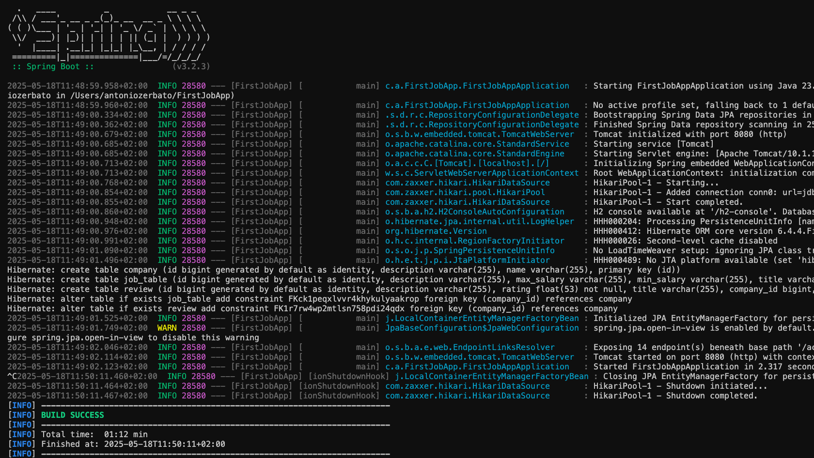

# JobAppMCV

JobAppMCV è un'applicazione sviluppata con Spring Boot che implementa l'architettura MVC (Model-View-Controller), separando le responsabilità tra Controller, Service e Model per una migliore manutenibilità e scalabilità.

## Architettura MVC

L'applicazione segue l'architettura MVC, suddivisa nei seguenti componenti:

- **Model**: Contiene le classi che rappresentano i dati dell'applicazione.
- **View**: Gestisce la presentazione dei dati all'utente.
- **Controller**: Gestisce le richieste dell'utente, interagisce con il Service e aggiorna la View.

In particolare, l'applicazione è strutturata in pacchetti distinti per ciascun componente:

- `com.example.jobappmcv.model`: Contiene le classi del Model.
- `com.example.jobappmcv.controller`: Contiene le classi del Controller.
- `com.example.jobappmcv.service`: Contiene le classi del Service.

## Compilazione e Installazione

### Prerequisiti

- Java 17 o superiore
- Maven 3.8 o superiore

### Clonazione del Repository

Clona il repository GitHub:

```bash
git clone https://github.com/antozerba/JobAppMCV.git
cd JobAppMCVls
```

## Compilazione del progetto
Utilizza Maven per compilare l'applicazione:
```bash
mvn clean install 
```

## Esecuzione dell'applicazione Spring Boot
Avvia l'applicazione con il plugin del tuo editor di testo oppure con il comando maven:
```bash
mvn spring-boot:run
``` 

L'applicazione sarà disponibile all'indirizzo http://localhost:8080.


